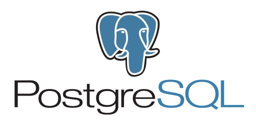

### Seja Bem-vindo ao meu GitHub. Eu sou Gabriel Clávila Soares
- Atualmente sou Analista de Tecnologia da Informação no IFAM
- Lotado na Coordenação Geral de Sistemas de Informação, trabalho diretamente no desenvolvimento e manutenção dos Sistemas de Informação do IFAM como desenvolver FullStack Java.
- Professor em Cursos de Extensão na Área de Ciência de Dados e Machine Learning
- Participo de Projetos de Pesquisa e Extensão voltados para as áreas de desenvolvimento de software e Inteligência Artificial
- Buscando constantemente aprender novas metodologias e tecnologias, atualmente realizo estudos nas áreas de DevOps e Inteligência Artificial.

#### Abaixo estão minhas principais Hard Skills:
#### Experiência nas seguintes Linguagens de Programação

  
  
  

#### Experiência nas seguintes Tecnologias de Backend Java

  
  
  
  
  
  
  
  
  
  

#### Experiência nas seguintes Tecnologias de FrontEnd

  
  
  
  
  
  
  
  

#### Experiência nos seguintes Bancos de Dados

  
  
  

#### Experiência nas seguintes Tecnologias de Cloud/DevOps

  
  
  
  
  
  

#### Experiência nas seguintes Tecnologias de Teste de Software

  
  
  

#### Experiência em Outras Tecnologias

  
  
  

#### Experiência nas seguintes Tecnologias e Conceitos de Data Science e Machine Learning
- Tecnologias
  - Numpy, Pandas, Matplotlib, Seaborn, Scikit-Learn, TensorFlow, Keras, PyTorch e OpenCV.
- Conceitos
  - Aprendizagem Supervisionada (Classificação e Regressão) e Não Supervisionada, Visão Computacional e Large Language Model (LLM)
